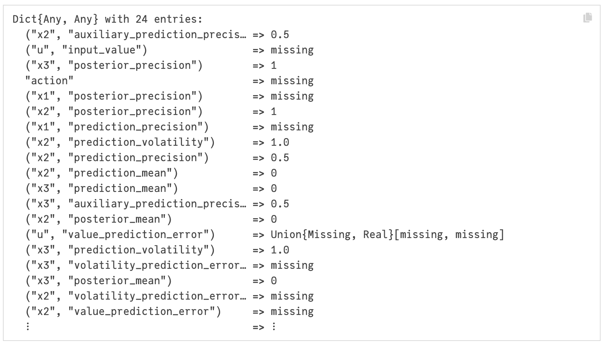
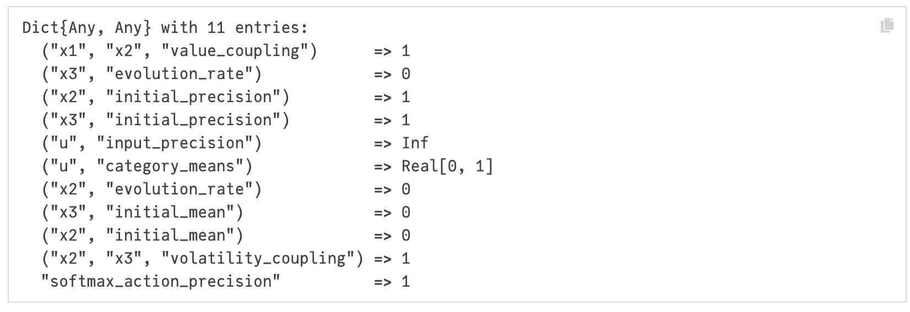
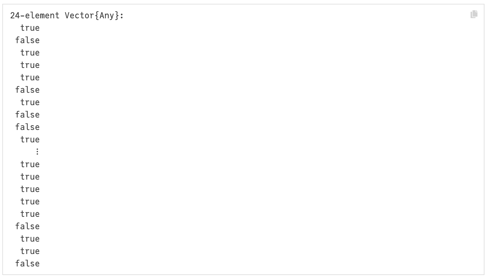
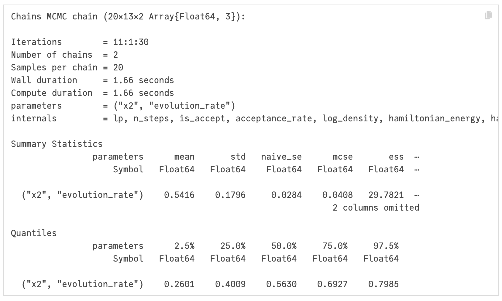
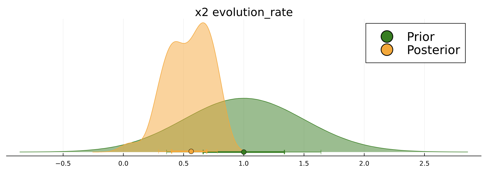

# HGF
[](https://ilabcode.github.io/HierarchicalGaussianFiltering.jl)
[](https://github.com/ilabcode/HierarchicalGaussianFiltering.jl/actions/workflows/CI_full.yml?query=branch%3Amain)
[](https://codecov.io/gh/ilabcode/HierarchicalGaussianFiltering.jl)
[](<https://www.gnu.org/licenses/>)


# Welcome to The Hierarchical Gaussian Filtering Package!

Hierarchical Gaussian Filtering (HGF) is a novel and adaptive package for doing cognitive and behavioral modelling. With the HGF you can fit time series data fit participant-level individual parameters, measure group differences based on model-specific parameters or use the model for any time series with underlying change in uncertainty.

The HGF consists of a network of probabilistic nodes hierarchically structured. The hierarchy is determined by the coupling between nodes. A node (child node) in the network can inheret either its value or volatility sufficient statistics from a node higher in the hierarchy (a parent node).

The presentation of a new observation at the lower level of the hierarchy (i.e. the input node) trigger a recursuve update of the nodes belief throught the bottom-up propagation of precision-weigthed prediction error.

The HGF will be explained in more detail in the theory section of the documentation

It is also recommended to check out the ActionModels.jl pacakge for stronger intuition behind the use of agents and action models.

## Getting started
The last official release can be downloaded from Julia with "] add HierarchicalGaussianFiltering"

We provide a script for getting started with commonly used functions and use cases

Load packages

````@example index
using HierarchicalGaussianFiltering
using ActionModels
````

### Get premade agent

````@example index
premade_agent("help")
````

### Create agent

````@example index
agent = premade_agent("hgf_binary_softmax_action")
````

### Get states and parameters

````@example index
get_states(agent)
````



````@example index
get_parameters(agent)
````



Set a new parameter for initial precision of xprob and define some inputs

````@example index
set_parameters!(agent, ("xprob", "initial_precision"), 0.9)
inputs = [1, 0, 1, 1, 1, 0, 1, 0, 1, 0, 1, 0, 1, 1, 1, 1, 1, 0, 0, 1, 0, 0, 0, 0];
nothing #hide
````

### Give inputs to the agent

````@example index
actions = give_inputs!(agent, inputs)
````

### Plot state trajectories of input and prediction

````@example index
using StatsPlots
using Plots
plot_trajectory(agent, ("u", "input_value"))
plot_trajectory!(agent, ("x", "prediction"))
````


Plot state trajectory of input value, action and prediction of x

````@example index
plot_trajectory(agent, ("u", "input_value"))
plot_trajectory!(agent, "action")
plot_trajectory!(agent, ("x", "prediction"))
````

### Fitting parameters

````@example index
using Distributions
prior = Dict(("xprob", "volatility") => Normal(1, 0.5))

model = fit_model(agent, prior, inputs, actions, n_iterations = 20)
````

### Plot chains

````@example index
plot(model)
````

### Plot prior angainst posterior

````@example index
plot_parameter_distribution(model, prior)
````

### Get posterior

````@example index
get_posteriors(model)
````

---
